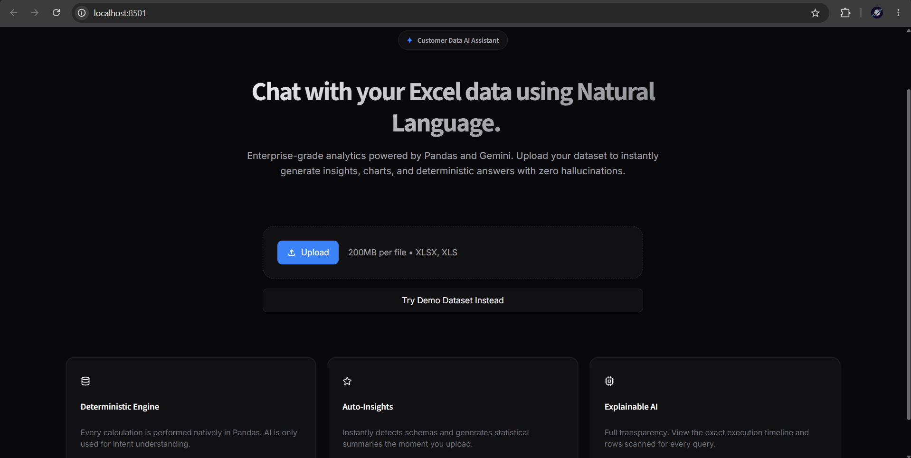
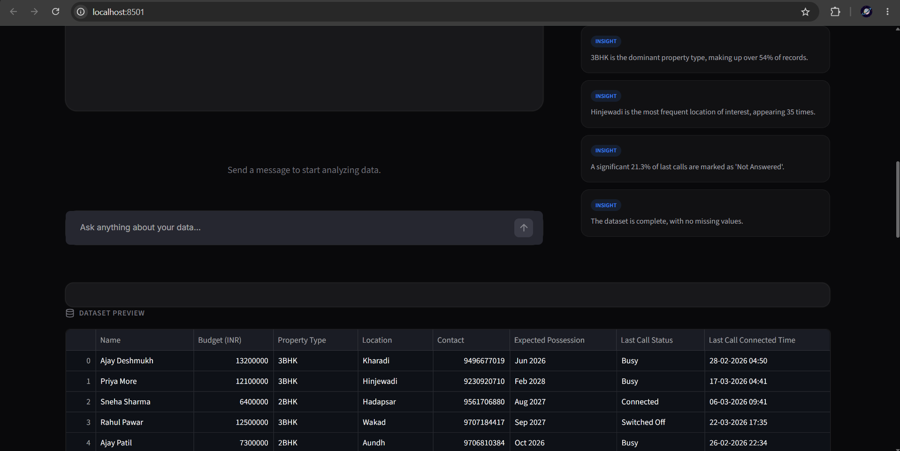
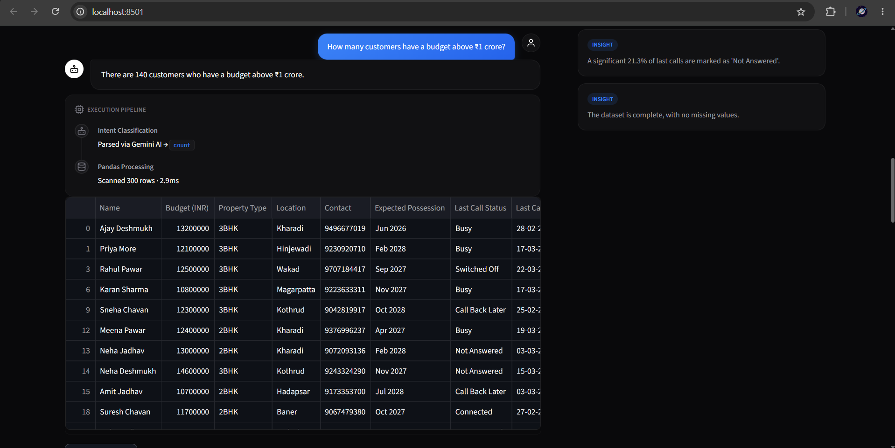
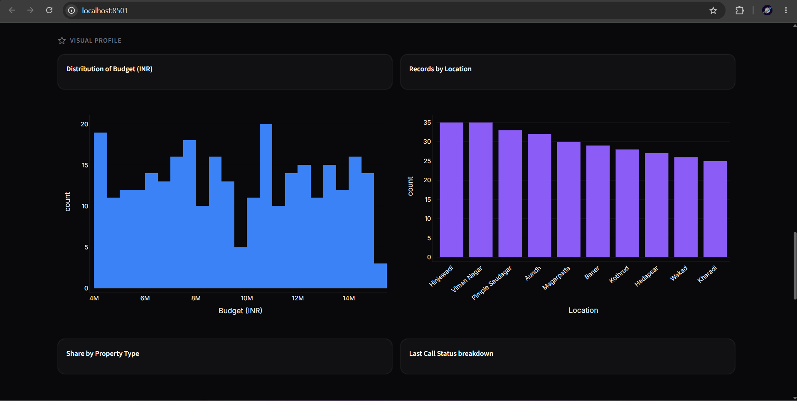
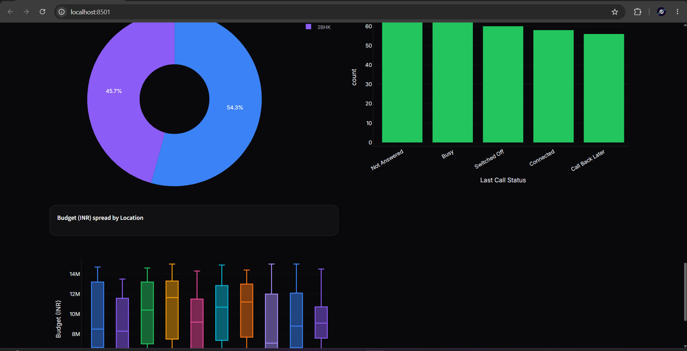
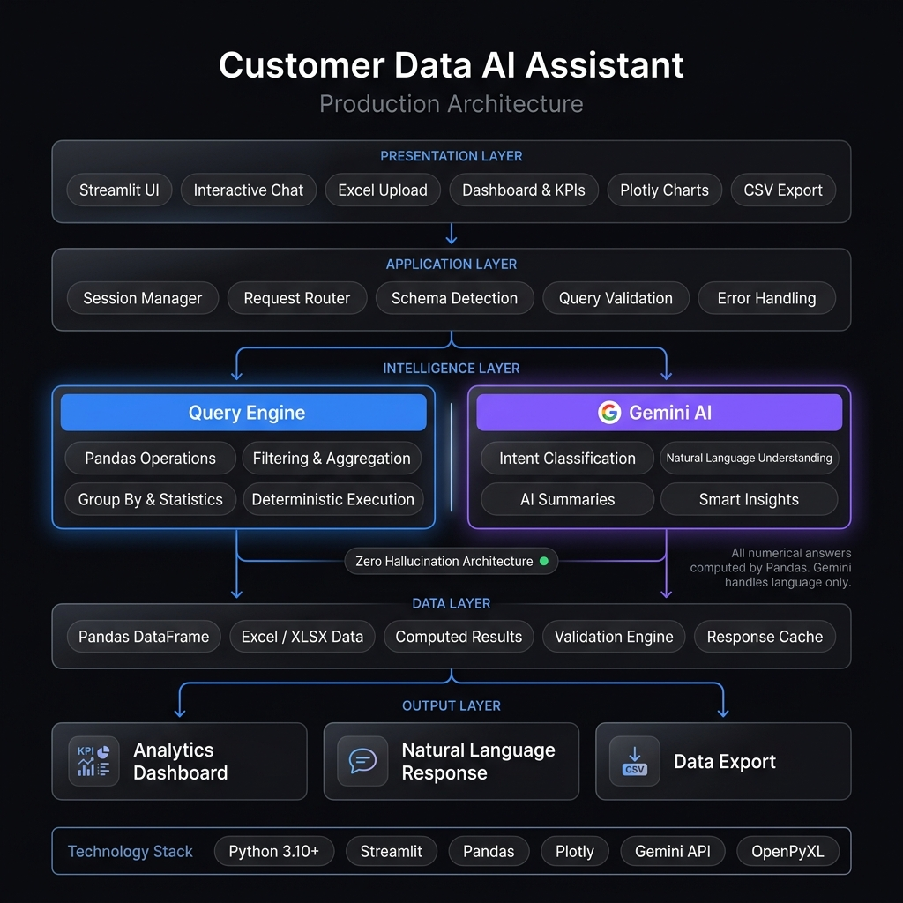

<div align="center">

# Customer Data AI Assistant

<p align="center">
  
</p>

**Natural language analytics for Excel and CSV data — deterministic, auditable, hallucination-free.**

Ask any question about your customer data in plain English.  
Every answer is computed by Pandas and verified before Gemini phrases it.

[](https://python.org)
[](https://streamlit.io)
[](https://ai.google.dev)
[](test_operations.py)
[](LICENSE)

[Getting Started](#getting-started) · [Architecture](#architecture) · [How It Works](#how-it-works) · [Supported Queries](#supported-queries)

</div>

---

## Overview

Business teams spend hours wrestling with pivot tables, VLOOKUP chains, and BI dashboards to answer straightforward questions: _"How many premium customers are in Pune?"_ or _"What is the average deal size this quarter?"_

LLMs promise to fix this through natural language — but LLMs cannot be trusted to compute numbers. Feed raw tabular data into a standard model and it will frequently hallucinate aggregations, invent statistics, and deliver confidently wrong answers.

**Customer Data AI Assistant** takes a different approach. It enforces a strict separation between language understanding and mathematical computation:

- **Google Gemini** classifies your question into a structured intent — the *what*.
- **Pandas** executes the computation deterministically — the *how*.
- **Gemini** then phrases the already-verified result as a natural language response.

The LLM never sees your raw data rows. It never performs arithmetic. Every number in every answer is the output of a CPU executing DataFrame operations — not a neural network estimating probabilities.

If Gemini is unavailable, rate-limited, or not configured, the system continues operating via a built-in rule-based intent parser. No external dependency is required for the core functionality to work.

---

## Screenshots

<table>
<tr>
<td width="50%">

<p align="center"><sub>Landing page — hero section with upload and demo dataset</sub></p>
</td>
<td width="50%">

<p align="center"><sub>KPI cards, data quality warnings, and column statistics</sub></p>
</td>
</tr>
<tr>
<td width="50%">

<p align="center"><sub>Chat interface with user and AI messages</sub></p>
</td>
<td width="50%">

<p align="center"><sub>Execution audit trail — intent method, operation, rows, and timing</sub></p>
</td>
</tr>
<tr>
<td width="50%">

<p align="center"><sub>Automatically selected Plotly visualization for query results</sub></p>
</td>
<td width="50%">

<p align="center"><sub>AI-generated dataset insights panel</sub></p>
</td>
</tr>
</table>

---

## Key Features

| Feature | Description |
|:--------|:------------|
| **Dynamic Schema Detection** | Automatically classifies any Excel or CSV column into semantic roles (budget, location, status, property type, date, contact) — no hardcoded column names |
| **20 Query Operations** | count, sum, average, median, min, max, filter, sort, groupby, topn, bottomn, between, greater\_than, less\_than, unique, distinct\_count, describe, list, date\_filter, missing |
| **Zero-Hallucination Engine** | Architectural separation ensures all numeric results come from Pandas; the LLM only phrases already-computed values |
| **Execution Audit Trail** | Every answer shows intent classification method, exact Pandas operation, columns accessed, rows scanned, and execution time |
| **Auto-Visualization** | Dynamically selects bar, pie, histogram, box, or correlation heatmap based on result shape and operation semantics |
| **Conversational Memory** | Follow-up questions intelligently merge context (e.g. "Who has a budget over 1Cr?" -> "And only in Pune?") |
| **Fuzzy & Normalized Matching** | (Phase 3) Deterministically catches inconsistent data entry (e.g. "Pune " vs "PUNE") for categorical fields like location, property type, or status using `rapidfuzz`, without needing an LLM to guess |
| **Dynamic Pandas Code Generation** | (Phase 1) When fixed filters aren't enough, Gemini securely generates pandas code to answer complex questions (e.g. "What is the average budget of leads in Mumbai compared to Pune?"). Code is executed inside a local sandbox with self-correcting retry loops |
| **Column Explorer** | Inline view of all columns with detected semantic role, dtype, missing percentage, and sample values |
| **AI-Generated Insights** | Automatically surfaces key patterns and statistics from the uploaded dataset on every load |
| **CSV + Excel Support** | Accepts `.xlsx`, `.xls`, and `.csv` files up to 50 MB |
| **Chat Export** | Download the full Q&A session as a formatted Markdown report |
| **Result Export** | Download any filtered query result as a CSV file |

---

## Architecture

<p align="center">
  
</p>

> **Privacy constraint:** Raw data rows never leave the local process. Only column names and inferred schema metadata are transmitted to the Gemini API for intent classification.

---

## Project Structure

```
customer-data-ai-assistant/
├── app.py                  Main application — Streamlit UI, routing, rendering
├── config.py               Central configuration — all tunables in one place
├── utils.py                File loading, validation, schema detection, profiling
├── query_engine.py         Deterministic Pandas execution engine (20 operations)
├── gemini_helper.py        Gemini API integration — retry, timeout, validation
├── models.py               Pydantic intent models (RootIntentModel, ConditionModel)
├── matching.py             Fuzzy/normalized string matching for categorical columns
├── charts.py               Plotly chart selection and dark-theme styling
├── style.css               Custom CSS — dark theme, typography, animations
├── test_query_engine.py    Primary test suite (114 tests)
├── test_matching.py        Fuzzy matching tests
├── test_schema_detection.py Schema detection tests
├── test_gemini_helper.py   Gemini intent parsing tests
├── requirements.txt        Pinned dependency versions
├── .env.example            Environment variable template
├── .gitignore              Security and artifact exclusions
├── LICENSE                 MIT License
└── data/
    └── sample_leads.xlsx   Bundled demo dataset (Pune real-estate leads)
```

| Module | Responsibility |
|:-------|:---------------|
| `config.py` | Model name, API timeouts, retry counts, upload limits, cache TTL, UI constants |
| `utils.py` | Server-side validation, Excel/CSV loading, keyword-based column role detection, dataset profiling |
| `query_engine.py` | 20 deterministic operation handlers, condition application, rule-based intent parser, conversational context merging |
| `gemini_helper.py` | Singleton SDK configuration, retry logic with configurable timeout, JSON extraction, intent validation against allowlist |
| `charts.py` | Automatic chart type selection, dark-theme color palette, profile overview charts including correlation heatmap |

---

## Getting Started

### Prerequisites

- Python 3.10 or higher
- A Google Gemini API key — optional; the application functions fully without one via the built-in fallback engine

### Installation

**1. Clone the repository**

```bash
git clone https://github.com/AkankshaShirke3107/Customer-Data-AI-Assistant.git
cd Customer-Data-AI-Assistant
```

**2. Create and activate a virtual environment**

```bash
python -m venv venv

# macOS / Linux
source venv/bin/activate

# Windows
venv\Scripts\activate
```

**3. Install dependencies**

```bash
pip install -r requirements.txt
```

**4. Configure environment variables**

```bash
cp .env.example .env
```

Edit `.env`:

```ini
GEMINI_API_KEY=your_api_key_here

# Optional — defaults shown
# GEMINI_MODEL=gemini-2.5-flash
# GEMINI_TIMEOUT_SECONDS=30
# MAX_UPLOAD_SIZE_MB=50
# LOG_LEVEL=INFO
```

Get a free Gemini API key at [aistudio.google.com](https://aistudio.google.com/app/apikey). The app runs without it using the rule-based parser.

### Running Locally

```bash
streamlit run app.py
```

Open `http://localhost:8501`. Click **"Try Demo Dataset Instead"** on the landing page to explore immediately without uploading a file.

### Running Tests

```bash
python -m pytest test_query_engine.py test_matching.py test_schema_detection.py test_gemini_helper.py -v
```

Expected: **125 passed** across all test modules in under 15 seconds.

---

## How It Works

### 1 · Upload and Schema Detection

`utils.py` performs server-side validation (extension allowlist, file size limit), loads the file via OpenPyXL or the CSV parser, and runs dynamic schema detection. Column names are matched against keyword lists to assign semantic roles — budget, location, property type, status, contact, date. No column names are hardcoded anywhere in the codebase.

### 2 · Intent Classification

The question is sent to Gemini with the column names and detected schema. The raw data is never included. Gemini returns a structured JSON intent:

```json
{
  "operation": "greater_than",
  "column": "Budget (INR)",
  "value": 9000000,
  "conditions": [
    { "column": "Preferred Location", "op": "eq", "value": "Pune" }
  ]
}
```

The response is validated against a 20-operation allowlist before any execution occurs. If validation fails, or if Gemini is unavailable, the rule-based parser in `query_engine.py` handles classification using keyword matching and regex patterns, including support for Indian numeric units (lakh, crore, k, million).

### 3 · Deterministic Execution

`query_engine.py` dispatches the validated intent to the corresponding handler:

```python
# "customers in Pune with budget above 90 lakhs" executes as:
filtered = df[df["Preferred Location"] == "Pune"]
result   = filtered[pd.to_numeric(filtered["Budget (INR)"], errors="coerce") > 9_000_000]
```

### 4 · Summarization

The computed result — a scalar value or a preview of the filtered DataFrame — is passed to Gemini with explicit instructions to phrase it naturally without altering any values. If Gemini is unavailable, a template-based summary is generated locally from the result metadata.

### 5 · Visualization

`charts.py` inspects the operation type and result shape to select the appropriate chart: bar charts for rankings and groupings, pie/donut charts for categorical distributions, histograms for numeric spreads, box plots for cross-sectional comparisons, and correlation heatmaps for multi-numeric datasets. All charts use a dark-theme-compatible color palette.

### 6 · Conversational Context

Filter conditions from the previous query are merged into the follow-up intent when the new query does not explicitly override them. This enables natural multi-turn conversations without requiring the user to repeat context.

### 7 · Dynamic Code Generation (Fallback Path)

If the intent parser cannot confidently match the question to one of the 20 fixed operations, the system falls back to a dynamic code generation pipeline:

1. **Generation:** Gemini is prompted to write a single Pandas expression or short block of code to answer the question, using only the provided DataFrame schema.
2. **Sandboxed Execution:** The generated code is executed in a restricted sandbox (`execute_sandboxed`) with a strict thread-based timeout (5 seconds) and a whitelisted set of builtins (no imports, no file I/O, no network calls). The original DataFrame is safely copied before execution.
3. **Self-Correction:** If the code fails (e.g., `KeyError` on a hallucinated column name, or a `SyntaxError`), the error is fed back to Gemini for up to 2 automatic correction retries.

This enables the application to answer complex, compound queries (e.g., *"Average budget of 2BHK buyers in Pune, grouped by contact status"*) that exceed the capabilities of the fixed operations, without compromising application stability.

---

## Supported Queries

| Category | Example | Operation |
|:---------|:--------|:----------|
| Count | "How many customers are there?" | `count` |
| Filtered count | "How many customers are in Pune?" | `count` + condition |
| Average | "What is the average budget?" | `average` |
| Sum | "Total budget for Kharadi leads" | `sum` + condition |
| Maximum | "Who has the highest budget?" | `max` |
| Minimum | "What is the lowest budget?" | `min` |
| Median | "What is the median budget?" | `median` |
| Greater than | "Customers with budget above 90 lakhs" | `greater_than` |
| Less than | "Leads with budget under 50 lakhs" | `less_than` |
| Range | "Budget between 80 and 120 lakhs" | `between` |
| Top N | "Top 5 customers by budget" | `topn` |
| Bottom N | "Bottom 3 customers by budget" | `bottomn` |
| Sort | "Sort customers by budget descending" | `sort` |
| Group by + aggregate | "Average budget by location" | `groupby` + mean |
| Distribution | "Breakdown of lead status" | `groupby` + count |
| Filter and list | "Show 2BHK customers in Baner" | `list` + conditions |
| Unique values | "What locations are in the data?" | `unique` |
| Distinct count | "How many unique locations?" | `distinct_count` |
| Statistics | "Describe the budget column" | `describe` |
| Date filter | "Customers added after March" | `date_filter` |
| Date — this month | "Show customers from this month" | `date_filter` |
| Missing values | "Customers with missing phone number" | `missing` |

### Conversational Follow-ups

```
User  ▸  "Show me Pune customers"
Bot   ▸  45 rows found

User  ▸  "Only those above 90 lakhs"
Bot   ▸  12 rows (Pune filter carried forward automatically)

User  ▸  "Sort them by budget"
Bot   ▸  12 rows sorted descending (both filters carried forward)
```

---

## Technical Highlights

### Modular Architecture

Each module has a single, clearly bounded responsibility. The UI layer (`app.py`) does not touch Pandas directly — all computation is delegated to `query_engine.py`. All Gemini calls are centralized in `gemini_helper.py`. Charts are fully decoupled in `charts.py`. All configuration constants live in `config.py`.

### Caching Strategy

`@st.cache_data` is applied with a content-hash key derived from DataFrame shape, column names, column dtypes, and a sample of row values — rather than hashing the full DataFrame. Gemini API responses are cached with a configurable TTL (default: 1 hour) to avoid redundant API calls for repeated questions.

### Error Handling and Resilience

Every pipeline stage has a fallback. If Gemini fails → rule-based parser. If summarization fails → template summary. If chart generation fails → response returned without visualization. The application does not crash on any user input.

### Prompt Engineering

System prompts enforce JSON-only output from Gemini with schema-grounded instructions. The model is given column names and semantic roles, never row data. Responses are validated against a strict operation allowlist before execution, preventing prompt injection from producing unauthorized operations.

### Hallucination Prevention

The architecture makes LLM hallucination structurally impossible for numeric answers:

1. Gemini outputs a JSON intent describing *what* to compute.
2. The intent is validated against a 20-item allowlist.
3. Pandas executes the operation and produces the result.
4. Gemini receives only the verified result for language rendering.

At no point does the LLM have access to the raw dataset or the ability to produce a numeric value independently.

### Security

- File uploads validated server-side for extension and size before any parsing occurs
- API keys loaded from `.env` files; `.gitignore` excludes them from version control
- Gemini SDK configured via a singleton guard that detects key rotation
- All API calls use configurable timeouts and automatic retries with exponential backoff

---

## Design Philosophy

Traditional LLM-powered data tools send raw CSVs to the model and ask it to compute answers. This is fundamentally unreliable:

| Concern | LLM Computation | Pandas Computation |
|:--------|:----------------|:-------------------|
| Accuracy | Probabilistic — prone to hallucination | Deterministic — exact |
| Reproducibility | May differ between calls | Identical for identical inputs |
| Auditability | Black box | Full execution trace available |
| Cost per query | API tokens consumed for computation | Zero — local CPU |
| Latency | Seconds (network + model inference) | Sub-millisecond |
| Data privacy | Raw data transmitted to external API | Data never leaves the process |

This project uses Gemini for what language models genuinely excel at — understanding free-form human intent and generating fluent prose — and delegates all computation to a library purpose-built for it.

---

## Contributing

Contributions are welcome. Please open an issue to discuss proposed changes before submitting a pull request.

```bash
# 1. Fork and clone
git clone https://github.com/your-username/Customer-Data-AI-Assistant.git

# 2. Create a feature branch
git checkout -b feature/your-feature-name

# 3. Make changes, then run the test suite
python -m pytest test_query_engine.py test_matching.py test_schema_detection.py test_gemini_helper.py -v

# 4. Push and open a pull request
git push origin feature/your-feature-name
```

Please ensure new query engine operations include corresponding tests in `test_query_engine.py` and docstrings in `query_engine.py`.

---

## License

This project is licensed under the [MIT License](LICENSE).

---

<div align="center">

Built with [Streamlit](https://streamlit.io) · [Pandas](https://pandas.pydata.org) · [Plotly](https://plotly.com) · [Google Gemini](https://ai.google.dev)

</div>
