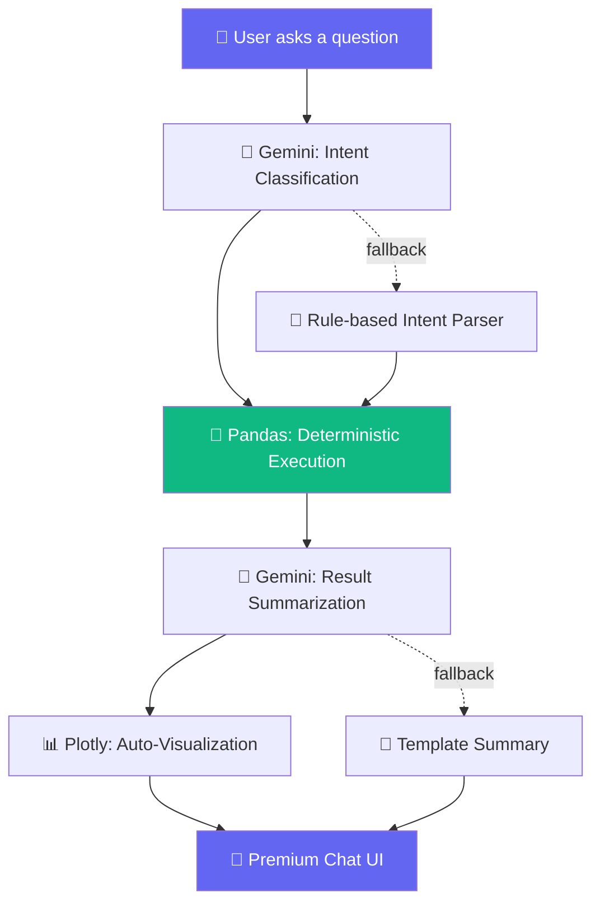

# 📊 Customer Data AI Assistant

[](https://python.org)
[](https://streamlit.io)
[](https://ai.google.dev)
[](https://pandas.pydata.org)
[](https://plotly.com)
[](LICENSE)

> **Chat with your Excel data using Natural Language — with zero hallucination guaranteed.**

A production-quality Streamlit application that lets you upload any customer-style Excel spreadsheet and ask plain-English questions about it — counts, averages, filters, top-N, group-bys, and more — with every single number computed deterministically by **pandas**, never guessed by AI.

Google Gemini is used **only** to (1) understand what you're asking and (2) phrase the already-computed pandas result as a friendly sentence. It never invents a number.

---

## 🏗️ Architecture



### Why Pandas for Computation Instead of Gemini?

| Aspect | Pandas (our approach) | LLM-only approach |
|--------|----------------------|-------------------|
| **Accuracy** | 100% deterministic | Prone to hallucination |
| **Reproducibility** | Same input = same output | May vary between calls |
| **Auditability** | Full execution trace shown | Black box |
| **Cost** | Free computation | API tokens per query |
| **Speed** | Milliseconds | Seconds |

Gemini is a **language tool**, not a calculator. We use it for what it's best at — understanding natural language — and let pandas handle what it's best at — computing exact numbers.

---

## ✨ Features

### Core Features
- **Dynamic schema detection** — no hardcoded column names; the app auto-classifies columns into semantic roles (name, budget, location, type, status, contact, dates)
- **Natural language Q&A** — counts, sums, averages, min/max, filters, sort, top-N, bottom-N, between-ranges, greater/less-than, group-by, unique values, distinct counts
- **Zero-hallucination engine** — Gemini maps questions to structured intents; pandas executes; results are phrased from computed ground truth
- **Rule-based fallback** — app works fully without a Gemini API key using keyword/regex parsing

### Premium Features
- **Explainability panel** — every answer shows the exact operation, filters, rows scanned/matched, execution time, and full execution pipeline
- **Confidence badges** — 🟢 High Confidence indicator proving pandas computed the answer
- **Key statistics dashboard** — instant metrics after upload (average budget, top city, most common type)
- **Follow-up questions** — conversational context ("Show Pune customers" → "Only those above 90 lakhs")
- **Suggested query cards** — beautiful clickable cards generated from detected schema
- **Auto-visualizations** — bar / pie / histogram / box charts chosen automatically (Plotly)
- **Chart downloads** — PNG export, fullscreen, responsive layout
- **CSV & TXT downloads** — export filtered data and summaries
- **Chat history** — timestamped queries with execution times, clearable
- **Dark mode** — premium toggle with smooth transitions
- **AI insights** — pandas-computed facts polished by Gemini into business-friendly bullets

### Technical Quality
- **Structured logging** throughout all modules
- **Central configuration** (`config.py`) for all tunables
- **Timeout & retry** on Gemini API calls
- **Intent validation** before query execution
- **File size & extension validation** on upload
- **Chat history limits** to prevent memory growth
- **Efficient caching** with content-hash keys

---

## 📁 Project Structure

```
Customer-Data-AI-Assistant/
├── app.py               # Streamlit UI — entry point with premium SaaS design
├── config.py            # Central configuration — all tunables in one place
├── utils.py             # Data loading, profiling, dynamic schema detection
├── query_engine.py      # Deterministic pandas execution + rule-based fallback
├── gemini_helper.py     # All Gemini API calls (intent + summarization + insights)
├── charts.py            # Automatic Plotly chart selection with responsive config
├── requirements.txt     # Python dependencies (pinned minimum versions)
├── .env.example         # Environment variable template
├── .gitignore           # Comprehensive ignore rules
├── README.md            # This file
└── data/
    └── sample_leads.xlsx  # Bundled sample dataset (Pune real-estate leads)
```

---

## 🚀 Installation

```bash
# Clone the repository
git clone https://github.com/AkankshaShirke3107/Customer-Data-AI-Assistant.git
cd Customer-Data-AI-Assistant

# Create and activate virtual environment
python -m venv venv
source venv/bin/activate       # macOS/Linux
# venv\Scripts\activate        # Windows

# Install dependencies
pip install -r requirements.txt
```

## 🔑 Environment Variables

Copy `.env.example` to `.env` and add your Gemini API key
(get one free at https://aistudio.google.com/app/apikey):

```bash
cp .env.example .env
```

| Variable | Required | Default | Description |
|----------|----------|---------|-------------|
| `GEMINI_API_KEY` | No* | — | Google Gemini API key |
| `GEMINI_MODEL` | No | `gemini-2.0-flash` | Model to use for intent/summary |
| `GEMINI_TIMEOUT_SECONDS` | No | `30` | API call timeout |
| `MAX_UPLOAD_SIZE_MB` | No | `50` | Maximum upload file size |
| `LOG_LEVEL` | No | `INFO` | Logging verbosity |

> *The app works fully without a Gemini API key using its rule-based fallback engine. You can also paste a key directly in the sidebar for a session-only test.

## ▶️ How to Run

```bash
streamlit run app.py
```

Open the printed local URL (typically http://localhost:8501). Check **"Use bundled sample dataset"** in the sidebar to try it immediately, or upload your own `.xlsx` file.

---

## 💬 Example Queries

| Query | Operation |
|-------|-----------|
| "How many customers have a budget above 90 lakhs?" | `greater_than` → count |
| "List customers looking for 2BHK in Kharadi" | `list` with conditions |
| "Which location has the highest average budget?" | `groupby` + mean |
| "Give me all customers interested in Baner" | `list` with location filter |
| "Show me customers whose budget is between 80 and 120 lakhs" | `between` |
| "What is the average budget?" | `average` |
| "Top 5 customers by budget" | `topn` |
| "How many unique locations are there?" | `distinct_count` |
| "Give me a breakdown of last call status" | `groupby` + count |
| "Average budget by location" | `groupby` + mean |

### Follow-up Queries (conversational context)
```
You: "Show Pune customers"
AI:  Found 45 matching rows...

You: "Only those above 90 lakhs"    ← inherits the Pune filter
AI:  Found 12 matching rows...

You: "Sort them by budget"           ← inherits all previous filters
AI:  Sorted by budget descending...
```

---

## 🧠 How the No-Hallucination Guarantee Works

```
Step 1: User asks → "What is the average budget in Pune?"

Step 2: Gemini receives the question + column names + schema
        Returns ONLY: {"operation": "average", "column": "Budget (INR)",
                        "conditions": [{"column": "Preferred Location", "op": "eq", "value": "Pune"}]}

Step 3: query_engine.py executes:
        df[df["Preferred Location"] == "Pune"]["Budget (INR)"].mean()
        → 8,750,000.0  (this is the ONLY place a number is produced)

Step 4: Gemini is shown ONLY the computed result (8,750,000.0)
        and asked to phrase it: "The average budget for Pune customers is ₹87.5 lakhs."

Step 5: The Explainability Panel shows the full pipeline so you can audit every step.
```

If Gemini is unavailable at any step, the app transparently falls back to a deterministic rule-based parser and template summary — it never breaks.

---

## 🖼️ Screenshots

> _Add screenshots here after running the app locally:_
- `docs/screenshot-overview.png` — Dataset overview with key statistics
- `docs/screenshot-chat.png` — Chat interface with explainability panel
- `docs/screenshot-chart.png` — Auto-generated chart with download options
- `docs/screenshot-pipeline.png` — Execution pipeline showing the no-hallucination flow

---

## 🛠️ Tech Stack

| Layer | Technology | Purpose |
|-------|-----------|---------|
| UI | Streamlit | Interactive web application |
| Data | Pandas, OpenPyXL | Data loading and computation |
| AI | Google Gemini API | Intent understanding + summarization only |
| Charts | Plotly | Interactive, responsive visualizations |
| Config | python-dotenv | Environment variable management |
| Typography | Inter (Google Fonts) | Modern, professional appearance |

---

## ✅ Assignment Requirements Mapping

| Requirement | Status | Implementation |
|-------------|--------|----------------|
| Excel Upload | ✅ Pass | `utils.py` — with size/extension validation |
| Natural Language Questions | ✅ Pass | `gemini_helper.py` + `query_engine.py` |
| Accurate Pandas Execution | ✅ Pass | `query_engine.py` — all 17 operations |
| Gemini for Intent Only | ✅ Pass | Gemini never computes, only classifies |
| No AI Hallucination | ✅ Pass | Full audit trail in explainability panel |
| Charts | ✅ Pass | `charts.py` — auto-selected Plotly charts |
| CSV Download | ✅ Pass | Per-query CSV + TXT export |
| Chat History | ✅ Pass | Timestamped, with execution times |
| Dataset Profiling | ✅ Pass | Key stats + column details + schema |
| Suggested Questions | ✅ Pass | Schema-aware clickable query cards |
| Error Handling | ✅ Pass | Graceful fallbacks at every layer |
| Caching | ✅ Pass | Content-hash keyed Streamlit caching |
| README | ✅ Pass | Professional with badges & architecture |
| Environment Variables | ✅ Pass | `.env.example` + runtime sidebar input |
| Production-Ready Code | ✅ Pass | Logging, config, validation, type hints |

---

## ⚠️ Known Limitations

- Single-file, single-sheet support (first sheet is loaded)
- Column classification is keyword-based (may misclassify exotic column names)
- Follow-up context uses simple keyword detection, not full coreference resolution
- Gemini API rate limits may throttle insights for rapid successive queries

---

## 🔮 Future Improvements

- Multi-file / multi-sheet support with cross-sheet joins
- User-editable schema overrides (manually re-map columns)
- Persistent chat history across sessions (SQLite-backed)
- Streaming token-by-token Gemini responses
- Natural-language chart requests ("show me a pie chart of X")
- Support for CSV / Google Sheets as additional input sources
- Role-based access control for shared deployments
- Automated test suite with pytest

---

## 📝 Notes

- Ships with a bundled sample dataset (`data/sample_leads.xlsx`, 300 rows of Pune real-estate leads) for instant demo. The schema detector generalizes to differently-named columns.
- Contact/phone numbers in the sample data are synthetic.
- This project is designed as an internship assignment submission demonstrating production-quality AI engineering practices.
