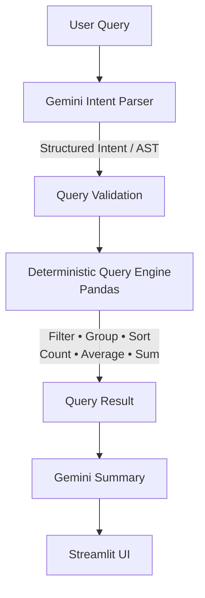

<div align="center">

# Customer Data AI Assistant

**An auditable, zero-hallucination natural language interface for tabular data.**

[](https://python.org)
[](https://streamlit.io)
[](https://ai.google.dev)
[](https://pandas.pydata.org)
[](https://docs.pydantic.dev/)
[](https://maxbachmann.github.io/RapidFuzz/)
[](LICENSE)

</div>

---

## Project Overview

**Customer Data AI Assistant** allows sales professionals and analysts to ask questions about their Excel and CSV datasets in plain English. 

Unlike traditional "chat with your data" tools that feed raw CSV rows to an LLM and hope for the best, this project enforces a strict architectural boundary. Google Gemini is utilized purely for language understanding and parsing. Every actual mathematical calculation—counting, filtering, grouping, and aggregating—is executed by deterministic Pandas code.

## Why This Project

Language models are exceptional at parsing human intent but notoriously unreliable at math and exact counting. When business decisions rely on data, hallucinations are unacceptable.

This project was built to demonstrate how to effectively bridge the gap between generative AI and reliable analytics by treating the **LLM as a compiler** rather than a calculator. By separating intent parsing from deterministic execution, the system provides auditable, mathematically provable answers to complex natural language queries.

---

## Architecture



## Core Design Principles

### LLM as Compiler, not Calculator

**Gemini:**
✅ Intent Parsing  
✅ Query Understanding  
✅ Natural Language Summary  

**Pandas:**
✅ Count  
✅ Average  
✅ Filter  
✅ Group By  
✅ Sort  
✅ Aggregation  

*No mathematical computation is ever delegated to the LLM.*

---

## Features

### Natural Language Querying
- Ask questions in plain English
- No SQL or programming required
- Works seamlessly with standard Excel (`.xlsx`) and CSV datasets

### Deterministic Query Engine
- Gemini understands intent only
- Pandas performs all computations
- Zero hallucinated calculations

### Dynamic Schema Detection
- Automatically classifies column semantic roles (e.g., Budget, Location, Property Type, Date, ID)
- Works dynamically across different datasets
- No hardcoded schemas or column names required

### Multi-Step Query Chaining
- Retains context between questions automatically.
- Example: 
  1. *Show Pune customers*
  2. *then sort by budget*
  3. *then top 5*

### Fuzzy Matching
Safely filters messy categorical data through an exact → normalized → fuzzy matching pipeline using RapidFuzz.
- **Supports:** `PUNE`, `Pune`, `pune`, `Pune City`
- **Typo correction:** `Khradi` → `Kharadi`
- **Whitespace/Case normalization:** `  mumbai ` → `Mumbai`

### Audit Trail
The UI explicitly shows its work, providing full auditability:
- Parsed operation and intent
- Rows scanned
- Rows returned
- Execution pipeline time
- Fuzzy corrections applied

### AI Dataset Insights
Automatically profiles uploaded data to surface key patterns:
- Dataset summary
- Top locations
- Budget statistics
- Property trends

---

## System Workflow
1. **Upload:** User uploads a CSV/Excel file.
2. **Profile:** `utils.py` dynamically infers the schema.
3. **Parse:** Gemini (or the offline fallback rule parser) translates the user's natural language into a Pydantic-validated JSON AST.
4. **Execute:** `operations.py` executes the exact Pandas operations requested.
5. **Summarize:** The final, computed scalar or DataFrame slice is returned to the user with an automatically generated chart.

---

## Tech Stack
- **Python 3.11**
- **Pandas** (Data manipulation and execution)
- **Streamlit** (Frontend UI and state management)
- **Google Gemini** (Intent parsing and generation)
- **RapidFuzz** (String normalization and fuzzy matching)
- **Pydantic** (Strict intent schema validation)
- **Plotly** (Auto-visualization)
- **OpenPyXL** (Excel file support)
- **NumPy** (Numerical operations)

---

## Repository Structure

```
Customer-Data-AI-Assistant/
├── app.py                  # Main application UI and routing
├── operations.py           # Deterministic Pandas query engine
├── sandbox.py              # Secure AST-validated dynamic code execution
├── matching.py             # RapidFuzz fuzzy/normalized categorical matching
├── gemini_helper.py        # Gemini API integration and retry logic
├── utils.py                # Schema detection and dataset profiling
├── charts.py               # Auto-visualization logic using Plotly
├── models.py               # Pydantic models for intent validation
├── config.py               # Central configuration constants
├── style.css               # Premium UI styling
├── tests/                  # Comprehensive test suites
└── README.md
```

---

## Installation

1. **Clone the repository:**
```bash
git clone https://github.com/AkankshaShirke3107/Customer-Data-AI-Assistant.git
cd Customer-Data-AI-Assistant
```

2. **Create and activate a virtual environment:**
```bash
python -m venv venv
source venv/bin/activate  # On Windows: venv\Scripts\activate
```

3. **Install dependencies:**
```bash
pip install -r requirements.txt
```

---

## Configuration

Duplicate the environment template:
```bash
cp .env.example .env
```

Add your Google Gemini API key to `.env`:
```ini
GEMINI_API_KEY=your_api_key_here
```
*(Note: If the key is omitted, the application will automatically fall back to its local, rule-based intent parser.)*

---

## Running the Project

Launch the Streamlit server:
```bash
streamlit run app.py
```
Open `http://localhost:8501`. You can upload your own dataset or click **"Try Demo Dataset Instead"** to test the system immediately.

---

## Example Queries

- *"How many customers have a budget above ₹90L?"*
- *"What is the average budget?"*
- *"Show Pune customers"*
- *"Show Pune customers then sort by budget"*
- *"Top 5 customers by budget"*
- *"Customers interested in 3BHK"*
- *"Count customers by Property Type"*
- *"Which location has the highest demand?"*

---

## How Query Processing Works

### Dynamic Schema Detection
Instead of hardcoding column names like `"Budget (INR)"`, the system inspects the dataset headers upon upload and assigns semantic roles. If a column is named `"Price"`, `"Cost"`, or `"Amount"`, it is dynamically mapped to `primary_budget_col`. This allows the intent parser to correctly route queries regardless of the client's specific spreadsheet formatting.

### Multi-Step Query Chaining
The system maintains a context tree in `st.session_state`. If you ask *"Show customers in Pune"*, and follow up with *"Sort them by budget"*, the engine intelligently merges the previous filter conditions into the new sorting intent without requiring an LLM to guess the context window.

### Fuzzy Matching
Human data entry is messy. If a user asks for *"Khradi"* but the dataset says *"Kharadi"*, the `matching.py` module evaluates the string distance using `rapidfuzz`. If the match scores above the configurable confidence threshold, it transparently applies the correction and logs it in the UI's Audit Trail so the user knows exactly what assumption was made.

### AI Insights
When a dataset is uploaded, a background task generates a high-level statistical profile of the data (missing values, top categorical distributions, budget ranges). This profile is fed to Gemini to generate three high-level business observations that render on the dashboard, giving users an immediate grasp of their data.

---

## Testing

The project maintains rigorous engineering standards with **125+ passing tests**.

- **Unit Tests**: Function-level validation.
- **Integration Tests**: End-to-end intent-to-result validation.
- **Query Engine Tests**: Validates that all 20 Pandas operations compute mathematically correct results.
- **Schema Detection Tests**: Ensures keyword heuristics correctly map abstract column roles.
- **Matching Tests**: Validates fuzzy string thresholding.
- **Sandbox Tests**: Validates that dynamic AST-scanned code prevents unauthorized execution and process timeouts trap infinite loops.

Run the test suite locally:
```bash
pytest
```

---

## Project Screenshots

*(Images are stored in the `/screenshots` directory)*

- **Home Page**: Initial upload screen.
- **Query Results**: Data grid returning answers.
- **Charts**: Auto-generated Plotly visuals.
- **AI Insights**: Automated statistical breakdown.
- **Audit Trail**: Transparent execution pipeline trace.

---

## Performance
- **O(1) Memory Footprint for Chat History**: Chat history exclusively caches lightweight UI components (capping historical dataframes at 200 rows) to prevent Out-Of-Memory crashes during extended sessions.
- **Efficient Caching**: Streamlit caching (`@st.cache_data`) leverages a lightweight hash of dataset metadata (shape, schema, 3-row sample) rather than hashing entire large datasets.

## Limitations
- **Stateful Concurrency**: Due to Streamlit's architecture, concurrent synchronous Gemini network calls block the main application thread. Multi-tenant load testing beyond a handful of concurrent users would require moving the query engine to a separate asynchronous backend.
- **Large Dataset Scale**: The system relies on Pandas and in-memory execution. It is designed for standard Excel sheets (up to ~50MB). Datasets larger than system RAM are not supported.

## Future Improvements
- **DuckDB Integration**: Replace Pandas with DuckDB for out-of-core execution on larger datasets.
- **FastAPI Backend**: Decouple the query engine into an asynchronous API.
- **React Frontend**: Move off Streamlit for more granular state and animation control.
- **Containerized Sandbox**: Replace the AST validation sandbox with a fully isolated Docker runtime.
- **Role-Based Authentication**: Secure datasets by user identity.
- **Cloud Deployment**: Automate CI/CD pipelines to AWS/GCP.
- **Semantic Search**: Implement embeddings for unstructured text columns (e.g., feedback notes).

---

## License

This project is licensed under the [MIT License](LICENSE).
