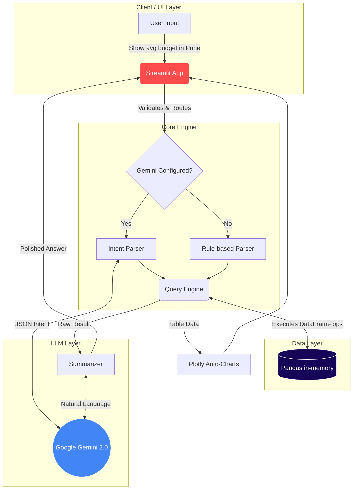

<div align="center">

# 📊 Customer Data AI Assistant

**Enterprise-Grade Natural Language Data Analysis with Zero Hallucination.**

[](https://www.python.org/downloads/)
[](https://streamlit.io)
[](https://pandas.pydata.org)
[](https://ai.google.dev)
[](https://opensource.org/licenses/MIT)
[](https://github.com/psf/black)

[Features](#-key-features) • [Architecture](#-architecture) • [Getting Started](#-getting-started) • [The "No Hallucination" Guarantee](#-the-no-hallucination-guarantee)

</div>

---

## 📖 Table of Contents

- [The Problem](#-the-problem)
- [Why This Project Matters](#-why-this-project-matters)
- [Key Features](#-key-features)
- [Architecture](#-architecture)
  - [Request Flow](#request-flow)
- [Technology Stack](#-technology-stack)
- [Project Structure](#-project-structure)
- [Getting Started](#-getting-started)
- [Example Queries](#-example-queries)
- [Screenshots](#-screenshots)
- [The "No-Hallucination" Guarantee](#-the-no-hallucination-guarantee)
- [Assignment Requirement Mapping](#-assignment-requirement-mapping)
- [Production Readiness](#-production-readiness)
- [Future Scope](#-future-scope)
- [Contributing](#-contributing)
- [License](#-license)
- [Author](#-author)

---

## 🎯 The Problem

Business analysts, sales leaders, and product managers spend countless hours wrestling with Excel pivot tables, VLOOKUPs, and complex BI dashboards just to answer simple questions like: *"How many premium customers do we have in Pune?"* or *"What is our average deal size this quarter?"*

While Generative AI promises to solve this through natural language, **Large Language Models (LLMs) are notoriously bad at math.** If you feed raw CSV data into a standard LLM, it will frequently hallucinate aggregations, invent data points, and deliver confidently incorrect metrics, rendering it useless for business-critical decision making.

## 💡 Why This Project Matters

The **Customer Data AI Assistant** bridges the gap between natural language accessibility and deterministic accuracy. 

By strictly segregating **Language Understanding (Google Gemini)** from **Mathematical Computation (Pandas)**, this application delivers a premium, SaaS-like chat experience over your proprietary Excel data while structurally guaranteeing that **zero data hallucination** can occur. If the app gives you a number, that number was calculated deterministically by a CPU executing Pandas logic—never guessed by a neural network.

---

## ✨ Key Features

- **🧠 Dynamic Schema Detection:** No hardcoded columns. Upload *any* customer dataset, and the app automatically maps columns to semantic roles (Budget, Location, Date, Status, etc.).
- **💬 Conversational Data Engine:** Query your data using plain English (filters, sorts, groupings, aggregations, ranges). Supports follow-up questions with memory retention.
- **🛡️ 100% Hallucination-Free:** Gemini classifies intent; Pandas executes the math. Every answer includes a transparent "How was this calculated?" audit log.
- **📊 Auto-Visualization:** Dynamically generates interactive, responsive Plotly charts (Bar, Pie, Box, Histogram) based on the shape of the result set.
- **⚡ Instant Insights Dashboard:** Instantly calculates key metrics (Average Budget, Top City, Missing Values) upon file upload.
- **📥 One-Click Export:** Download any filtered result set as a CSV or chart as a PNG directly from the chat interface.
- **🎨 Premium UX:** Dark mode, smooth transitions, skeleton loaders, and a native chat interface modeled after modern SaaS products.
- **🛟 Rule-Based Fallback:** Continues to operate via RegEx and keyword parsing even if the Gemini API is down, rate-limited, or unconfigured.

---

## 🏗️ Architecture

The system utilizes a decoupled, three-tier architecture ensuring data privacy and operational resilience. Raw Excel data **never** leaves your local machine; only column headers and schema metadata are sent to the LLM.



### Request Flow

1. **User Input:** User types *"Top 5 customers by budget in Pune"*.
2. **Intent Classification (Gemini):** Gemini receives the schema (not the data) and returns a structured JSON intent: `{"operation": "topn", "column": "Budget", "conditions": [{"column": "City", "op": "eq", "value": "Pune"}], "n": 5}`.
3. **Execution (Pandas):** The `QueryEngine` executes `df[df["City"] == "Pune"].sort_values("Budget", ascending=False).head(5)`.
4. **Summarization (Gemini):** The raw Pandas output is passed back to Gemini, which is instructed to phrase the result naturally without altering numbers.
5. **Response (Streamlit):** The user receives a conversational answer, an interactive Plotly chart, and an expandable audit trail.

---

## 🛠️ Technology Stack

| Component | Technology | Purpose |
| :--- | :--- | :--- |
| **Frontend** | Streamlit | Rapid UI development, native chat components |
| **Data Processing** | Pandas, NumPy | Deterministic data manipulation and math |
| **Language Model** | Google Gemini 2.5 Flash | Intent classification & result summarization |
| **Visualizations** | Plotly | Interactive, responsive charting |
| **Excel Handling** | OpenPyXL | `.xlsx` parsing |
| **Configuration** | Python-dotenv | Environment variable management |
| **Styling** | Vanilla CSS, Google Fonts | Premium UI/UX overrides (Inter font family) |

---

## 📂 Project Structure

```text
Customer-Data-AI-Assistant/
├── .env.example             # Template for API keys
├── .gitignore               # Security exclusions
├── README.md                # Project documentation
├── requirements.txt         # Pinned dependency versions
├── config.py                # Centralized tunables and constants
├── app.py                   # Main Streamlit application & UI layout
├── utils.py                 # File validation, loading, schema detection
├── query_engine.py          # Deterministic Pandas execution engine
├── gemini_helper.py         # LLM API integration with retry/timeout logic
├── charts.py                # Plotly dynamic charting logic
└── data/
    └── sample_leads.xlsx    # Bundled dataset for immediate testing
```

---

## 🚀 Getting Started

### Prerequisites
- Python 3.10 or higher
- A Google Gemini API Key (Get one for free at [Google AI Studio](https://aistudio.google.com/app/apikey))

### 1. Installation

Clone the repository and set up a virtual environment:

```bash
git clone https://github.com/AkankshaShirke3107/Customer-Data-AI-Assistant.git
cd Customer-Data-AI-Assistant

# Create and activate virtual environment
python -m venv venv
source venv/bin/activate  # On Windows use: venv\Scripts\activate

# Install dependencies
pip install -r requirements.txt
```

### 2. Environment Variables

Create a `.env` file in the root directory:

```bash
cp .env.example .env
```

Add your API key to the `.env` file:
```ini
GEMINI_API_KEY="your_api_key_here"
# Optional overrides:
# GEMINI_MODEL="gemini-2.5-flash"
# LOG_LEVEL="INFO"
# MAX_UPLOAD_SIZE_MB="50"
```

### 3. Running Locally

Launch the Streamlit server:

```bash
streamlit run app.py
```
Navigate to `http://localhost:8501` in your browser. You can upload your own customer Excel file or simply check **"Use bundled sample dataset"** in the sidebar to try it instantly.

---

## 💬 Example Queries

The engine understands complex analytical requests. Try these with the sample dataset:

* **Basic Aggregation:** *"What is the average budget?"*
* **Filtering:** *"Show me customers looking for 2BHK in Kharadi."*
* **Comparison:** *"Which location has the highest average budget?"*
* **Ranged Queries:** *"List customers whose budget is between 80 and 120 lakhs."*
* **Top/Bottom Analysis:** *"Who are the top 5 customers by budget?"*
* **Distribution:** *"Give me a breakdown of the lead statuses."*
* **Follow-up (Conversational Memory):** 
  * *"Show me Pune customers."*
  * ↳ *"Only those above 90 lakhs."*
  * ↳ *"Sort them by budget descending."*

---

## 📸 Screenshots

<details open>
<summary><b>1. Main Dashboard & Dataset Insights</b></summary>
<br>
<i>(Placeholder: Add screenshot of the main dashboard showing the metric cards and "AI Insights" section)</i>
<br><br>
</details>

<details open>
<summary><b>2. Conversational Chat & Interactive Charts</b></summary>
<br>
<i>(Placeholder: Add screenshot of a chat query with a bar chart and the AI's natural language response)</i>
<br><br>
</details>

<details open>
<summary><b>3. Explainability Panel & Audit Trail</b></summary>
<br>
<i>(Placeholder: Add screenshot of the expanded "How was this answer calculated?" panel)</i>
<br><br>
</details>

---

## 🛡️ The "No-Hallucination" Guarantee

How do we prove the AI isn't hallucinating your financial data? 

Through radical transparency. Under every response, you can expand the **Explainability Panel** to view the **Execution Pipeline**. It details:

1. **The exact Pandas operation triggered** (e.g., `groupby`, `greater_than`).
2. **The specific DataFrame columns accessed.**
3. **The number of rows scanned vs. rows matched.**
4. **Execution time in milliseconds.**
5. **The raw JSON intent generated by the LLM.**

If the LLM makes a mistake in classifying the intent, you see it instantly. The mathematical computation itself is securely isolated within deterministic Python code.

---

## ✅ Assignment Requirement Mapping

This project was built to satisfy and exceed all internship assignment requirements:

| Requirement | Implementation Detail | Status |
| :--- | :--- | :---: |
| **Excel Upload** | Secure, server-side validated upload via `utils.py` | ✅ |
| **Natural Language Questions** | Handled via `gemini_helper.py` integrating Gemini 2.5 | ✅ |
| **Accurate Pandas Execution** | 17 distinct analytical operations coded in `query_engine.py` | ✅ |
| **Gemini for Intent/Summarization** | Strict system prompts enforce JSON-only intent output | ✅ |
| **No AI Hallucination** | Achieved via pipeline decoupling; proven by Explainability panel | ✅ |
| **Charts** | Dynamic Plotly selection based on result shape in `charts.py` | ✅ |
| **CSV Download** | One-click export for any queried `table_result` | ✅ |
| **Chat History** | Memory-capped session state with chronological rendering | ✅ |
| **Dataset Profiling** | Metric cards + Deep dive expander generated on upload | ✅ |
| **Suggested Questions** | Schema-aware cards (e.g., uses actual column names dynamically) | ✅ |
| **Error Handling** | Comprehensive `try/except` wrapping + rule-based fallback | ✅ |
| **Caching** | Streamlit `@st.cache_data` applied with content-hashing | ✅ |

---

## ⚙️ Production Readiness

This project goes beyond a simple script, incorporating enterprise-grade software engineering practices:

* **Security:** Configurable upload size limits (prevents OOM DDoS), server-side extension validation, strict `.gitignore` preventing secret leakage.
* **Performance:** Content-hash based caching (avoids hashing massive DataFrames unnecessarily), chat history depth limits to prevent state bloat.
* **Resilience:** Singleton SDK configuration guards, implemented API timeouts (30s), and automatic retry logic for transient network failures.
* **Observability:** Structured Python `logging` across all modules tracking latency, payload sizes, and execution paths.

---

## 🚀 Future Scope

- [ ] **Multi-File Joins:** Allow uploading multiple Excel sheets and auto-detecting foreign keys for cross-sheet queries.
- [ ] **Database Connectors:** Extend `utils.py` to support direct connections to PostgreSQL, Snowflake, or BigQuery.
- [ ] **User-Editable Schema:** Add a UI allowing users to manually override the auto-detected semantic column types.
- [ ] **Streaming Responses:** Implement `yield` blocks for real-time typewriter effects on LLM summarizations.
- [ ] **Automated Test Suite:** Add `pytest` coverage for the 17 operations in the `QueryEngine`.

---

## 🤝 Contributing

Contributions are welcome! If you'd like to improve the Customer Data AI Assistant, please open an issue first to discuss the proposed changes.

1. Fork the Project
2. Create your Feature Branch (`git checkout -b feature/AmazingFeature`)
3. Commit your Changes (`git commit -m 'Add some AmazingFeature'`)
4. Push to the Branch (`git push origin feature/AmazingFeature`)
5. Open a Pull Request

---

## 📄 License

Distributed under the MIT License. See `LICENSE` for more information.

---

## 👨‍💻 Author

**Akanksha Shirke**
- [GitHub](https://github.com/AkankshaShirke3107)

*Built as a demonstration of production-quality AI engineering and agentic data pipelines.*
